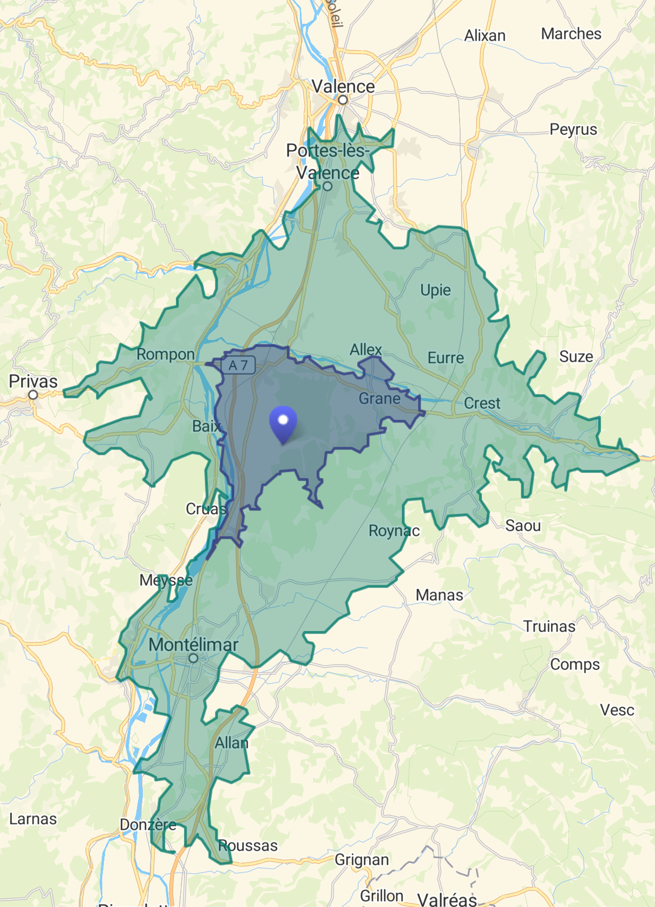

<a href="#" id="scrollToTopButton" class="no-underline" style="position: fixed; bottom: 20px; right: 20px; background-color: #ffffff; color: #000000; border-radius: 50%; text-align: center; width: 50px; height: 50px; display: flex; justify-content: center; align-items: center; font-size: 24px; box-shadow: 0 4px 8px 0 rgba(0, 0, 0, 0.75); z-index: 1000; text-decoration: none;">
🏠
</a>

  
If something isn’t working, contact Fede! 😊

  <button onclick="document.getElementById('feedbackDialog').style.display='none'" style="border: none; background-color: transparent; color: #000000; font-size: 24px; cursor: pointer;">&times;</button>

Save the Date! On <b>Saturday, November 23rd, 2024</b> at <b>12:30 PM</b>, we will celebrate our marriage at Parroquia Nuestra Señora de Belén in Crevillent, Alicante. 

<b>We would love to celebrate this special day with you!</b>

--------------------------

<h5 style="font-weight: 500;">✏️</h5>

# RSVP

Please confirm your attendance and provide other important details by October 31st by filling out the following questionnaire (one response per person):

<iframe src="https://docs.google.com/forms/d/e/1FAIpQLScn_mITxiso-J6NSb7TVs6DcicrjqXkIYAKEqnf-_0gGAkOCg/viewform?embedded=true" width="100%" height="490" frameborder="0" marginheight="0" marginwidth="0">Loading…</iframe>

--------------------------

<h5 style="font-weight: 500;">🥂</h5>

# Planning of the Day

The ceremony will take place at Parroquia Nuestra Señora de Belén in Crevillente (Alicante) at 12:30 PM. The celebration will continue at Finca Los Pinos in Orihuela (Alicante).

  

    <strong>Ceremony</strong> 💍
    <iframe src="https://www.google.com/maps/embed?pb=!1m18!1m12!1m3!1d3133.3307802883182!2d-0.8113005238611887!3d38.248633684722684!2m3!1f0!2f0!3f0!3m2!1i1024!2i768!4f13.1!3m3!1m2!1s0xd63b96aef80a90b%3A0x6044a6ec6f39b085!2sParroquia%20Nuestra%20Se%C3%B1ora%20de%20Bel%C3%A9n!5e0!3m2!1ses!2ses!4v1718550695018!5m2!1ses!2ses" style="border:0; width: 100%; height: 200px;" allowfullscreen="" loading="lazy" referrerpolicy="no-referrer-when-downgrade"></iframe>
  

  

    <strong>Celebration</strong> 🍾
    <iframe src="https://www.google.com/maps/embed?pb=!1m18!1m12!1m3!1d3138.586353519015!2d-0.9982486238659392!3d38.12655669181772!2m3!1f0!2f0!3f0!3m2!1i1024!2i768!4f13.1!3m3!1m2!1s0xd639a114efff9e5%3A0xd0b1e906828f2a9d!2sFinca%20Los%20Pinos%20Orihuela!5e0!3m2!1ses!2ses!4v1718551002198!5m2!1ses!2ses" style="border:0; width: 100%; height: 200px;" allowfullscreen="" loading="lazy" referrerpolicy="no-referrer-when-downgrade"></iframe>
  

<h3><u>From Elche/Murcia to the event</u></h3>

##### 🚎 Buses

Remember to reserve your spot on the confirmation form if you want to leave your car at home! We will provide more details soon about the departure/arrival points and schedules.

##### 🚕 Taxi 

If you need a taxi, you can contact the following numbers:

- __Radio Taxi Murcia__: <a href="tel:+34968248800">+34 968248800</a>
- __Radio Taxi Elche__: <a href="tel:+34965427777">+34 965427777</a>
- __Radio Taxi Orihuela__: <a href="tel:+34966740202">+34 966740202</a> (PREGUNTAR A PILAR)

*_Availability of other services like Uber or Cabify may vary depending on the city._

<h3><u>Weather</u></h3>

Check out the weather forecast! Most of the time we will be indoors, but if the weather permits, part of the celebration will be held outside.

<a class="weatherwidget-io" href="https://forecast7.com/en/38d24n0d81/crevillent/" data-label_1="CREVILLENTE" data-theme="pure" >CREVILLENTE WEATHER</a>

--------------------------

<h5 style="font-weight: 500;">The trip 🛫</h5>

# Accommodation

Unfortunately, there are not many accommodation options close to the ceremony and celebration venues. Therefore, we suggest a few options in Elche and Murcia near the bus departure/arrival points.

<h3><u>Elche</u></h3>

<ul>
  <li><strong><a href="https://www.melia.com/es/hoteles/espana/elche/hotel-elche-centro-by-melia">Hotel Elche Centro</a></strong>
    <ul style="margin-left: -5px;">
      <!-- <li>A 6 minutos andando del punto de recogida y llegada.</li> -->
      <li>Booking: (PREGUNTAR A PILAR) </li>
      <!-- <li>Precio estimado: </li> -->
    </ul>
  </li>
</ul>

<h3><u>Murcia</u></h3>

<ul>
  <li><strong><a href="https://www.sercotelhoteles.com/es/hotel-jc1">Sercotel JC1 Murcia</a></strong>
    <ul style="margin-left: -5px;"> <!-- Adjust the margin-left value as needed -->
      <li>Booking: (PREGUNTAR A PILAR) </li>
    </ul>
  </li>
  <li><strong><a href="https://www.marriott.com/es/hotels/mjvmu-ac-hotel-murcia/overview/">AC Hotel Murcia</a></strong>: 
    <ul style="margin-left: -5px;"> <!-- Adjust the margin-left value as needed -->
      <li>Booking: (PREGUNTAR A PILAR) </li>
    </ul>
  </li>
</ul>

--------------------------

<h5 style="font-weight: 500;">The trip 🛫</h5>

# Traveling to Elche/Murcia

If you’re coming from outside the area, here are some options for reaching our location besides driving:

##### ✈️ By plane

- **Elche**: __[Aeropuerto de Alicante-Elche Miguel Hernández](https://maps.app.goo.gl/D1qDbhC29rnDk5xK8)__

- **Murcia**: __[Aeropuerto Internacional Región de Murcia](https://maps.app.goo.gl/SDqXM27MGrHeqQwc9)__

##### 🚄 By train

- **Elche**: __[Estación Elx Parc](https://maps.app.goo.gl/p7xb2tobo8PikV2d8)__

- **Murcia**: __[Estación Murcia del Carmen](https://maps.app.goo.gl/H8zhooP1LvTrUPJG9)__

--------------------------

<h5 style="font-weight: 500;">The trip 🛫</h5>

# Stay

If you’re planning to spend a few more days in the area, here are some recommendations:

<h3><u>Elche</u></h3>

__What to do?__

- **Historic Center**: Explore the old town of Elche with its narrow streets, charming squares, and historic buildings.
- **Basilica of Santa María**: Visit this stunning Baroque basilica, famous for hosting the Misteri d'Elx.
- **Palmeral of Elche**: Stroll through this vast palm grove, a UNESCO World Heritage site with over 200,000 palm trees.

__Where to eat?__

- (PREGUNTAR A FARA)

<!-- #### Murcia -->
<h3><u>Murcia</u></h3>

__What to do?__

- **Historic Center**: Wander through the old town, filled with squares, churches, and historic buildings.
- **Murcia Cathedral**: Visit the Cathedral of Santa María, which features Gothic, Renaissance, and Baroque styles. Climb the tower for panoramic views.
- **Plaza del Cardenal Belluga**: Explore the central square, home to the Episcopal Palace and the Baroque facade of the cathedral.

__Where to eat?__

- **Plaza de las Flores**: Enjoy tapas at one of the popular restaurants or bars in this bustling square in Murcia.

--------------------------

<h5 style="font-weight: 500;">Misc. 🪩</h5>

# Music

Is there a song you’d like to hear at our wedding?  
Join the playlist and add any songs you want!

<iframe style="border-radius:12px" src="https://open.spotify.com/embed/playlist/5520URYIoxO4rIzITUCW9J?utm_source=generator" width="100%" height="352" frameBorder="0" allowfullscreen="" allow="autoplay; clipboard-write; encrypted-media; fullscreen; picture-in-picture" loading="lazy"></iframe>

--------------------------

<h5 style="font-weight: 500;">Misc. 🪩</h5>

# Gifts

Sharing this day with you is already the best gift. If you’d like to contribute to our honeymoon, you can do so in the following way:

<strong>🇪🇸 ES48 2100 3356 6422 0018 7835</strong>

<strong>🇳🇱 NL44 ABNA 0871 8787 39</strong>

--------------------------

<h5 style="font-weight: 500;">📞</h5>

# Contact us

If you have any questions or need assistance, feel free to contact us:

  

    <table style="width: 70%; margin: auto;">
      <tr>
        <td><strong>Clara:&nbsp;</strong></td>
        <td>🇪🇸 <a href="tel:+34695304944">+34 695304944</a></td>
      </tr>
      <tr>
        <td></td>
        <td>🇳🇱 <a href="tel:+31651137240">+31 651137240</a></td>
      </tr>
      <tr>
        <td></td>
        <td> <a href="https://wa.me/34695304944">WhatsApp</a></td>
      </tr>
      <tr>
        <td></td>
        <td> <a href="https://t.me/claricornio">Telegram</a></td>
      </tr>
    </table>
  

  

    <table style="width: 70%; margin: auto;">
      <tr>
        <td><strong>Fede:&nbsp;&nbsp;</strong></td>
        <td>🇪🇸 <a href="tel:+34617272064">+34 617272064</a></td>
      </tr>
      <tr>
        <td></td>
        <td>🇳🇱 <a href="tel:+31651138018">+31 651138018</a></td>
      </tr>
      <tr>
        <td></td>
        <td> <a href="https://wa.me/34617272064">WhatsApp</a></td>
      </tr>
      <tr>
        <td></td>
        <td> <a href="https://t.me/fedopedo">Telegram</a></td>
      </tr>
    </table>
  

  

<!-- <a href="#" id="scrollToTopButton" class="no-underline" style="position: fixed; bottom: 20px; right: 20px; background-color: #ffffff; color: #000000; border-radius: 50%; text-align: center; width: 50px; height: 50px; display: flex; justify-content: center; align-items: center; font-size: 24px; box-shadow: 0 4px 8px 0 rgba(0, 0, 0, 0.75); z-index: 1000; text-decoration: none;">
🏠
</a>

  
If something doesn't work, text Fede 😊

  <button onclick="document.getElementById('feedbackDialog').style.display='none'" style="border: none; background-color: transparent; color: #000000; font-size: 24px; cursor: pointer;">&times;</button>

Si estás leyendo esto es porque te esperamos el <b>Sábado 23 de Noviembre del 2024</b> a las <b>12:00h</b> en la <b>Parroquia Nuestra Señora de Belén</b> de Crevillente, Alicante.

<b>Acompáñanos en el día de nuestra boda!</b>

--------------------------
# Questionnaire

<iframe src="https://docs.google.com/forms/d/e/1FAIpQLSc0Lh4Xv0yae3Ni2sVE5vSpzXrnqaIZqFpuXHgnXUnup9AcqQ/viewform?embedded=true" width="100%" height="490" frameborder="0" marginheight="0" marginwidth="0">Cargando…</iframe>

--------------------------
# Location

&nbsp; 

#### **Ceremonia** 💍
Parroquia Nuestra Señora de Belén (Crevillente, Alicante) el pueblo de la cornio

<iframe src="https://www.google.com/maps/embed?pb=!1m18!1m12!1m3!1d3133.3307802883182!2d-0.8113005238611887!3d38.248633684722684!2m3!1f0!2f0!3f0!3m2!1i1024!2i768!4f13.1!3m3!1m2!1s0xd63b96aef80a90b%3A0x6044a6ec6f39b085!2sParroquia%20Nuestra%20Se%C3%B1ora%20de%20Bel%C3%A9n!5e0!3m2!1ses!2ses!4v1718550695018!5m2!1ses!2ses" style="border:0;" allowfullscreen="" loading="lazy" referrerpolicy="no-referrer-when-downgrade"></iframe>

#### **Celebración** 🥂🍾
Finca Los Pinos (Orihuela, Alicante)

<iframe src="https://www.google.com/maps/embed?pb=!1m18!1m12!1m3!1d3138.586353519015!2d-0.9982486238659392!3d38.12655669181772!2m3!1f0!2f0!3f0!3m2!1i1024!2i768!4f13.1!3m3!1m2!1s0xd639a114efff9e5%3A0xd0b1e906828f2a9d!2sFinca%20Los%20Pinos%20Orihuela!5e0!3m2!1ses!2ses!4v1718551002198!5m2!1ses!2ses" style="border:0;" allowfullscreen="" loading="lazy" referrerpolicy="no-referrer-when-downgrade"></iframe>

#### **El tiempo** 🌞

Aunque en el Levante solemos gozar de días soleados y agradables en Noviembre, échale un ojo a la predicción meterorologica si eres friolero/a! La mayoría del tiempo estaremos en espacios interiores, pero, si el tiempo lo permite, nos tomaremos alguna que otra en exteriores. 

<a class="weatherwidget-io" href="https://forecast7.com/en/38d24n0d81/crevillent/" data-label_1="CREVILLENTE" data-theme="pure" >CREVILLENTE WEATHER</a>

--------------------------
# Transport

&nbsp; 

## Desde Elche/Murcia al evento

### Autobuses 🚎
<b>Ida:</b>
- Murcia → Crevillente: 
- Elche → Crevillente: 

<b>Vuelta:</b>
- Orihuela → Murcia: 
- Orihuela → Elche: 

## ¿Cómo llegar a Elche/Murcia?

*There are lots of ways to get here, but we think many people will consider these options.*

### By Plane ✈️

There are two major airports nearby, that have many direct flights per day from London, Paris and other nearby European destinations. Both have lots of car rental options (recommended):
- [**Lyon-Saint Exupéry Airport**](https://www.skyscanner.net/transport/flights/lond/lys/220708/220710/?adults=1&adultsv2=1&cabinclass=economy&children=0&childrenv2=&destinationentityid=27544221&inboundaltsenabled=false&infants=0&originentityid=27544008&outboundaltsenabled=false&preferdirects=false&ref=home&rtn=1)
    - 1hr 40 flight from London
    - 1hr 25 drive to wedding venue
- [**Marseille Provence Airport**](https://www.skyscanner.net/transport/flights/lond/mrs/220708/220710/?adults=1&adultsv2=1&cabinclass=economy&children=0&childrenv2=&destinationentityid=32030366&inboundaltsenabled=false&infants=0&outboundaltsenabled=false&preferdirects=false&ref=home&rtn=1)
    - 1hr 55 flight from London
    - 1hr 30 drive to wedding venue

### By Train 🚄

You can get closer to the venue by train, but it may involve more travel time for UK guests. For non-European residents, this may be preferable to changing to another plane in Paris.

_Please note, train stations are NOT walking distance from venue, and there is limited public transport._

- **High Speed Train to Gare Valence TGV**
    - Possible good option for those flying into France from further afield (eg North America)
    - 2hr 52 train from Paris Charles de Gaulle Airport
    - 2hr 15 train from Paris Gare de Lyon
    - 30 min drive to venue
        - There seems to be a [local taxi company](https://goo.gl/maps/kYnRsqoHtsyBN99PA). Taxis c. €100 to venue each way.
        - There are many car rental agencies at the destination train station (Hertz, Enterprise, Alamo etc)
- **Eurostar to Montelimar Gare.**
    - 6hr 43 train from London St Pancras
    - 20 min drive to wedding venue.
        - There are multiple taxi companies in Montelimar. Taxis c. €60-80 to venue each way.
            - [Taxi-at2c](https://g.page/taxi-at2c-christian-chaneac?share)
            - [Taxi Deschamps](https://goo.gl/maps/eVLpYvtpe7EF6irv8)
            - [Alex Taxi](https://www.google.com/maps/place/Alex+Taxi/@44.5540842,4.6744026,15z/data=!4m6!3m5!1s0x12b5144f9305631b:0x1702c0e6a4d2d7af!8m2!3d44.5540236!4d4.6799899!15sCgx0YXhpIHNlcnZpY2WSAQx0YXhpX3NlcnZpY2U)
        - There are also car rental agencies (Avis, Thrifty)

### By Car 🚗

We’ve googled this so you don’t have to. It’s a 10-12 hr drive from London 😓

--------------------------
# AGENDA

&nbsp; 

We are hiring the venue from Friday 8th July to Sunday 10th July inclusive. We have events each day, and they are all at the same venue. You are welcome to come to as much or as little as you like.

This is the rough plan:

- **Friday**
    - 6pm - 8pm: Buffet dinner for those arriving the day before
    - Pool open - if you want to take a dip bring along your swimmers
- **Saturday - Main Event**     
  *Dress: "Riviera Chic" (See [FAQs](../faq/))*
    - Before 1:30pm: Time for you to explore the local area
    - 1:30pm - 2pm: Guests arrive at the venue
    - 2pm - 3pm: Ceremony
    - 3pm - 5pm: Canapes 
    - 5pm - 7pm: Drinks, Lawn Games
    - 7pm - 10pm: Dinner, Speeches
    - 10pm - Late: Music & Dancing
    
- **Sunday**
    - 10am - 12pm: Buffet Brunch 
    - 12pm - 6pm: Relaxing by the pool & in the grounds
    - Guests can stay until 6pm, when we have to vacate

--------------------------
# Accommodation

&nbsp; 

There are lots of good accommodation options nearby, some walkable from the venue, and many within a 20-25 min drive radius between nearby Montélimar and Valence. 

|[{: width="250" }](../assets/images/15-and-30-min-drivetimes.png)|
|:---:|
|*15 and 30 min drivetimes from the venue*|

However, don't hang about too long on booking - it's peak summer season in France!

### Selected Options 🌇

-  ~~[**Hotel les Oliviers**](https://hotel-les-oliviers.eu/)~~ -  Fully Booked 
-   ~~[**Hôtel restaurant La Capitelle**](http://www.lacapitelle.com/en/)~~ - Fully Booked 

-  [**Hotel IBIS Montélimar North**](https://all.accor.com/hotel/0623/index.en.shtml?dateIn=2022-07-08&nights=2&compositions=2&stayplus=false#origin=accor)
    - 6 min drive from venue (1hr walk)
    - Budget friendly option
- [**La Treille Muscate**](https://www.hotelrestaurant-latreillemuscate.com/)
    - 6 min drive from venue (40 min walk)
    - Small boutique hotel & restaurant in nearby town
- [**Camping La Poche**](https://www.camping-lapoche.eu/en/)
    - 5 min drive from venue (40 min walk)
    - Pretty campsite with amenities. 
    - Camping sites available, mobile home rental available by the week (€500 for up to 6 people)
- **[Booking.com](https://www.booking.com/searchresults.en-gb.html?label=gen173nr-1DCAEoggI46AdIM1gEaCeIAQGYAQm4ARfIAQ_YAQPoAQGIAgGoAgO4AoS-tZIGwAIB0gIkNzZjMjM1Y2YtM2FjYS00ZTcwLWE2NTAtMTA0NGMzNTEwNTRk2AIE4AIB&sid=84dbf8d58c741ae2b7e3d8e255230e9f&aid=304142&ss=26270+Rue+Louis+Fereyre%2C+Loriol-sur-Dr%C3%B4me%2C+France&ssne=26270+Rue+Louis+Fereyre%2C+Loriol-sur-Dr%C3%B4me%2C+France&ssne_untouched=26270+Rue+Louis+Fereyre%2C+Loriol-sur-Dr%C3%B4me%2C+France&lang=en-gb&latitude=44.7541476&longitude=4.8175266&checkin=2022-07-08&checkout=2022-07-10&group_adults=2&no_rooms=1&group_children=0&sb_travel_purpose=leisure&nflt=oos%3D1&order=distance_from_search) and [Airbnb](https://www.airbnb.com/s/Saulce~sur~Rhône/homes?place_id=ChIJO6q-k4RGtRIRcv4ZRcSqyuo&refinement_paths[]=%2Fhomes&checkin=2022-07-08&checkout=2022-07-10&adults=2&search_type=user_map_move&tab_id=home_tab&query=Saulce-sur-Rhône&flexible_trip_lengths[]=weekend_trip&date_picker_type=calendar&ne_lat=44.845739525943884&ne_lng=5.098128874917336&sw_lat=44.51843933386909&sw_lng=4.438399837483473&zoom=10&search_by_map=true)** have a few places available
- **Local ["Gites"](https://www.gites-de-france.com/en)** are less likely to be on the major booking platforms, but will probably give you a more authentic French country experience

--------------------------
# Music 🪩

&nbsp; 

<iframe style="border-radius:12px" src="https://open.spotify.com/embed/playlist/77wx6QR3jmcOF5NY72ksTo?utm_source=generator&theme=0" width="100%" height="352" frameBorder="0" allowfullscreen="" allow="autoplay; clipboard-write; encrypted-media; fullscreen; picture-in-picture" loading="lazy"></iframe>

<iframe style="border-radius:12px" src="https://open.spotify.com/embed/playlist/5520URYIoxO4rIzITUCW9J?utm_source=generator" width="100%" height="352" frameBorder="0" allowfullscreen="" allow="autoplay; clipboard-write; encrypted-media; fullscreen; picture-in-picture" loading="lazy"></iframe>

--------------------------
# Contact 📞

&nbsp; 

Para cualquier duda o consulta, contacta con nosotros!

- Clara: 🇪🇸 [+34 695304944](tel:+34695304944) / 🇳🇱 [+31 651137240](tel:+31651137240)
- Fede: 🇪🇸 [+34 617272064](tel:+34617272064) / 🇳🇱 [+31 651138018](tel:+31651138018) -->
